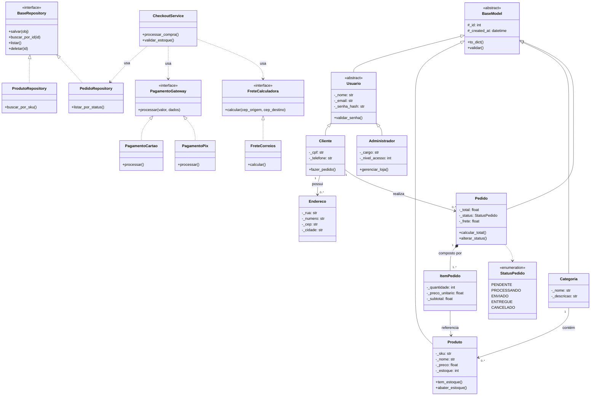

```mermaid
classDiagram
    %% --- MODELOS ---
    class BaseModel {
        <<abstract>>
        #_id: int
        #_created_at: datetime
        +to_dict()
        +validar()
    }

    class Usuario {
        <<abstract>>
        -_nome: str
        -_email: str
        -_senha_hash: str
        +validar_senha()
    }

    class Cliente {
        -_cpf: str
        -_telefone: str
        +fazer_pedido()
    }

    class Administrador {
        -_cargo: str
        -_nivel_acesso: int
        +gerenciar_loja()
    }

    class Endereco {
        -_rua: str
        -_numero: str
        -_cep: str
        -_cidade: str
    }

    class Produto {
        -_sku: str
        -_nome: str
        -_preco: float
        -_estoque: int
        +tem_estoque()
        +abater_estoque()
    }

    class Categoria {
        -_nome: str
        -_descricao: str
    }

    class Pedido {
        -_total: float
        -_status: StatusPedido
        -_frete: float
        +calcular_total()
        +alterar_status()
    }

    class ItemPedido {
        -_quantidade: int
        -_preco_unitario: float
        -_subtotal: float
    }

    class StatusPedido {
        <<enumeration>>
        PENDENTE
        PROCESSANDO
        ENVIADO
        ENTREGUE
        CANCELADO
    }

    %% Heranças de Modelo
    BaseModel <|-- Usuario
    BaseModel <|-- Produto
    BaseModel <|-- Categoria
    BaseModel <|-- Pedido
    Usuario <|-- Cliente
    Usuario <|-- Administrador

    %% Associações de Modelo
    Cliente "1" --> "0..*" Endereco : possui
    Categoria "1" --> "0..*" Produto : contém
    Pedido "1" *-- "1..*" ItemPedido : composto por
    ItemPedido --> Produto : referencia
    Cliente "1" --> "0..*" Pedido : realiza
    Pedido ..> StatusPedido

    %% --- INTERFACES E STRATEGIES ---
    class PagamentoGateway {
        <<interface>>
        +processar(valor, dados)
    }

    class PagamentoCartao {
        +processar()
    }

    class PagamentoPix {
        +processar()
    }

    class FreteCalculadora {
        <<interface>>
        +calcular(cep_origem, cep_destino)
    }

    class FreteCorreios {
        +calcular()
    }

    %% Implementações
    PagamentoGateway <|.. PagamentoCartao
    PagamentoGateway <|.. PagamentoPix
    FreteCalculadora <|.. FreteCorreios

    %% --- REPOSITÓRIOS ---
    class BaseRepository {
        <<interface>>
        +salvar(obj)
        +buscar_por_id(id)
        +listar()
        +deletar(id)
    }

    class ProdutoRepository {
        +buscar_por_sku()
    }
    
    class PedidoRepository {
        +listar_por_status()
    }

    BaseRepository <|.. ProdutoRepository
    BaseRepository <|.. PedidoRepository

    %% --- SERVIÇOS ---
    class CheckoutService {
        +processar_compra()
        +validar_estoque()
    }

    %% Dependências de Serviço
    CheckoutService ..> PedidoRepository : usa
    CheckoutService ..> PagamentoGateway : usa
    CheckoutService ..> FreteCalculadora : usa
```