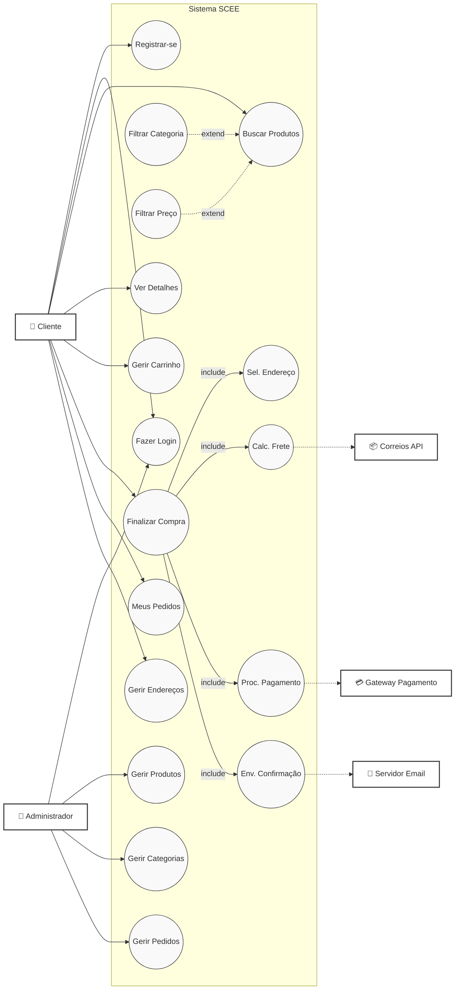

```mermaid
graph LR
    %% Atores (Representados com ícones para clareza)
    Client[👤 Cliente]
    Admin[👤 Administrador]
    
    %% Sistemas Externos
    SysCorreios[📦 Correios API]
    SysPag[💳 Gateway Pagamento]
    SysEmail[📧 Servidor Email]

    %% Fronteira do Sistema
    subgraph "Sistema SCEE"
        direction TB
        UC1((Fazer Login))
        UC2((Registrar-se))
        
        UC3((Buscar Produtos))
        UC3_1((Filtrar Categoria))
        UC3_2((Filtrar Preço))
        
        UC4((Ver Detalhes))
        UC5((Gerir Carrinho))
        
        UC6((Finalizar Compra))
        UC6_1((Sel. Endereço))
        UC6_2((Calc. Frete))
        UC6_3((Proc. Pagamento))
        UC6_4((Env. Confirmação))
        
        UC7((Meus Pedidos))
        UC8((Gerir Endereços))
        
        UC_Adm1((Gerir Produtos))
        UC_Adm2((Gerir Categorias))
        UC_Adm3((Gerir Pedidos))
    end

    %% Relacionamentos do Cliente
    Client --> UC2
    Client --> UC1
    Client --> UC3
    Client --> UC4
    Client --> UC5
    Client --> UC6
    Client --> UC7
    Client --> UC8

    %% Relacionamentos do Admin
    Admin --> UC1
    Admin --> UC_Adm1
    Admin --> UC_Adm2
    Admin --> UC_Adm3

    %% Relacionamentos de Include (Linha sólida ou com rótulo)
    UC6 -->|include| UC6_1
    UC6 -->|include| UC6_2
    UC6 -->|include| UC6_3
    UC6 -->|include| UC6_4

    %% Relacionamentos de Extend (Linha pontilhada)
    UC3_1 -.->|extend| UC3
    UC3_2 -.->|extend| UC3

    %% Integrações Externas
    UC6_2 -.-> SysCorreios
    UC6_3 -.-> SysPag
    UC6_4 -.-> SysEmail

    %% Estilização para parecer mais com UML
    classDef actor fill:#fff,stroke:#333,stroke-width:2px;
    classDef usecase fill:#f9f9f9,stroke:#333,stroke-width:1px,rx:20,ry:20;
    classDef system fill:#eee,stroke:#999,stroke-dasharray: 5 5;
    
    class Client,Admin,SysCorreios,SysPag,SysEmail actor;
    class UC1,UC2,UC3,UC3_1,UC3_2,UC4,UC5,UC6,UC6_1,UC6_2,UC6_3,UC6_4,UC7,UC8,UC_Adm1,UC_Adm2,UC_Adm3 usecase;
```